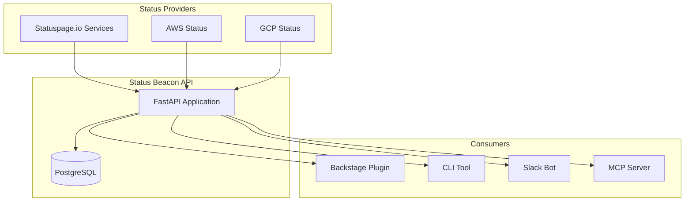
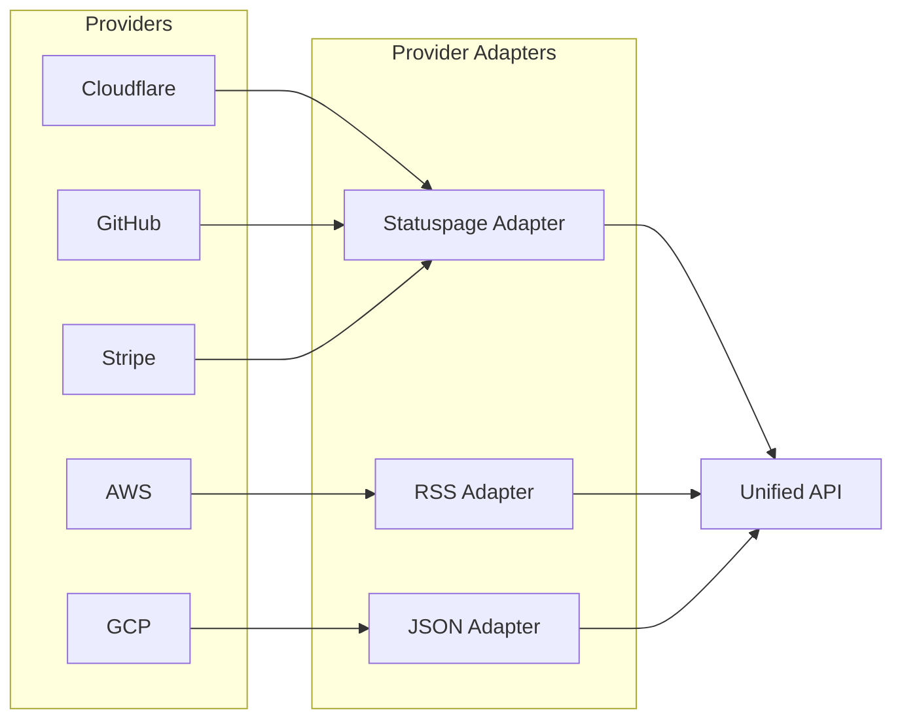

# Status Beacon API

**Cloud status aggregator API with Backstage integration for monitoring third-party service health.**

[](https://www.python.org/downloads/)
[](https://fastapi.tiangolo.com/)
[](https://opensource.org/licenses/MIT)
[](https://github.com/astral-sh/ruff)

## Overview

Status Beacon aggregates status information from multiple cloud providers and SaaS services into a single, unified API. It's designed to help platform and DevOps teams:

- Monitor third-party service health in one place
- Integrate status information into Backstage service catalogs
- Understand blast radius when vendors report incidents
- Get early warning of potential issues affecting your infrastructure

## Architecture



### Provider Integration



## Features

- **Unified API** - Single endpoint to query status from multiple providers
- **Provider Abstraction** - Pluggable adapters for different status page formats
- **Async by Default** - Built with `asyncio` for high-performance polling
- **Type Safe** - Full type hints with strict mypy configuration
- **API-First** - OpenAPI/Swagger documentation out of the box

## Quick Start

### Prerequisites

- Python 3.13+
- Docker and Docker Compose
- [uv](https://github.com/astral-sh/uv) (recommended) or pip

### Using Docker Compose (Recommended)

1. Clone the repository:
   ```bash
   git clone https://github.com/yourusername/status-beacon-api.git
   cd status-beacon-api
   ```

2. Create your environment file:
   ```bash
   cp .env.example .env
   # Edit .env with your configuration
   ```

3. Start the services:
   ```bash
   docker compose up -d
   ```

4. Verify it's running:
   ```bash
   curl http://localhost:8000/api/v1/health
   # {"status":"healthy","version":"0.1.0"}
   ```

5. Access the API documentation at http://localhost:8000/docs

### Local Development

1. Install dependencies:
   ```bash
   uv sync --all-extras
   ```

2. Set up environment variables:
   ```bash
   cp .env.example .env
   # Edit .env - at minimum set POSTGRES_* variables
   ```

3. Start PostgreSQL (using Docker):
   ```bash
   docker compose up -d db
   ```

4. Run the development server:
   ```bash
   uv run uvicorn src.main:app --reload
   ```

## Configuration

Configuration is managed through environment variables. Copy `.env.example` to `.env` and customize:

| Variable | Required | Default | Description |
|----------|----------|---------|-------------|
| `POSTGRES_USER` | Yes | - | Database username |
| `POSTGRES_PASSWORD` | Yes | - | Database password |
| `POSTGRES_HOST` | Yes | - | Database host |
| `POSTGRES_DB` | Yes | - | Database name |
| `POSTGRES_PORT` | No | `5432` | Database port |
| `DEBUG` | No | `false` | Enable debug mode |
| `ENVIRONMENT` | No | `development` | Environment (development/staging/production) |
| `CORS_ORIGINS` | No | `["http://localhost:3000","http://localhost:7007"]` | Allowed CORS origins |
| `STATUS_POLL_INTERVAL_SECONDS` | No | `60` | How often to poll status pages |

## API Endpoints

| Method | Endpoint | Description |
|--------|----------|-------------|
| `GET` | `/api/v1/health` | Health check |
| `GET` | `/api/v1/services` | List all monitored services |
| `GET` | `/api/v1/services/{id}/status` | Get status for a specific service |
| `GET` | `/api/v1/incidents` | List current incidents |
| `GET` | `/docs` | Swagger UI documentation |
| `GET` | `/redoc` | ReDoc documentation |

## Project Structure

```
status-beacon-api/
├── src/
│   ├── api/
│   │   └── v1/
│   │       ├── routes/        # API endpoints
│   │       │   └── health.py
│   │       └── router.py      # Route aggregation
│   ├── core/
│   │   └── config.py          # Configuration management
│   ├── models/                # Pydantic & SQLAlchemy models
│   ├── providers/             # Status page adapters
│   ├── services/              # Business logic
│   └── main.py                # Application entry point
├── tests/
│   ├── api/                   # API integration tests
│   └── unit/                  # Unit tests
├── docker-compose.yml
├── Dockerfile
└── pyproject.toml
```

## Development

### Running Tests

```bash
# Run all tests
uv run pytest

# Run with coverage
uv run pytest --cov=src --cov-report=term-missing

# Run specific test file
uv run pytest tests/api/test_health.py -v
```

### Code Quality

```bash
# Linting
uv run ruff check src/ tests/

# Auto-fix linting issues
uv run ruff check --fix src/ tests/

# Format code
uv run ruff format src/ tests/

# Type checking
uv run mypy src/

# Security scanning
uv run bandit -r src/
```

### Pre-commit Hooks

Install pre-commit hooks to automatically check code quality before commits:

```bash
uv run pre-commit install
```

This runs ruff, mypy, and bandit automatically on staged files.

## Contributing

Contributions are welcome! Please follow these steps:

1. **Fork** the repository
2. **Create** a feature branch (`git checkout -b feature/amazing-feature`)
3. **Make** your changes
4. **Run** tests and linting (`uv run pytest && uv run ruff check src/`)
5. **Commit** your changes (`git commit -m 'Add amazing feature'`)
6. **Push** to the branch (`git push origin feature/amazing-feature`)
7. **Open** a Pull Request

### Adding a New Provider

To add support for a new status page provider:

1. Create a new adapter in `src/providers/`:
   ```python
   from src.providers.base import StatusProvider

   class MyProviderAdapter(StatusProvider):
       async def fetch_status(self) -> ServiceStatus:
           # Implementation here
           pass
   ```

2. Register the provider in the provider registry
3. Add tests in `tests/unit/providers/`
4. Update documentation

### Code Style

- Follow [PEP 8](https://pep8.org/) conventions
- Use type hints for all function signatures
- Write docstrings for public functions and classes
- Keep functions focused and under 50 lines when possible

## Roadmap

- [ ] Statuspage.io adapter (Cloudflare, GitHub, Stripe, etc.)
- [ ] AWS Status RSS adapter
- [ ] GCP Status JSON adapter
- [ ] Backstage plugin
- [ ] Terraform state parsing for auto-discovery
- [ ] Blast radius visualization
- [ ] Slack notifications
- [ ] MCP server integration

## License

This project is licensed under the MIT License - see the [LICENSE](LICENSE) file for details.

## Acknowledgments

- [FastAPI](https://fastapi.tiangolo.com/) - Modern Python web framework
- [Pydantic](https://docs.pydantic.dev/) - Data validation using Python type hints
- [uv](https://github.com/astral-sh/uv) - Fast Python package manager
- [Backstage](https://backstage.io/) - Open platform for building developer portals
